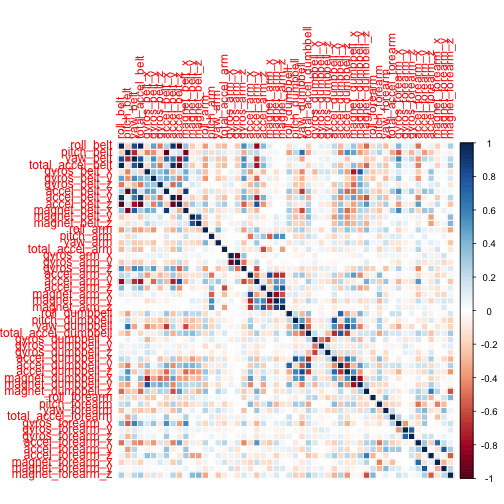
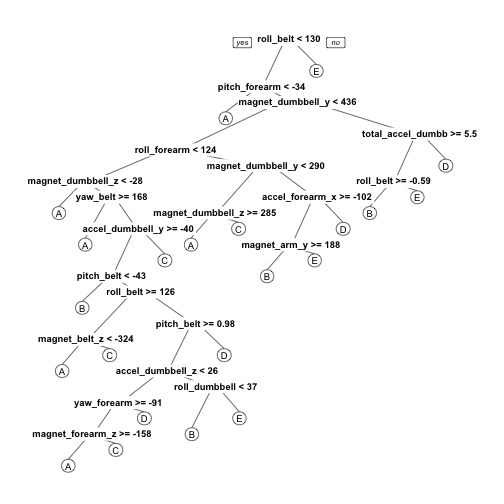

### Introduction  

Using devices such as Jawbone Up, Nike FuelBand, and Fitbit it is now possible to collect a large amount of data about personal activity relatively inexpensively. These type of devices are part of the quantified self movement ? a group of enthusiasts who take measurements about themselves regularly to improve their health, to find patterns in their behavior, or because they are tech geeks. One thing that people regularly do is quantify how much of a particular activity they do, but they rarely quantify how well they do it.  
  
In this project, we will use data from accelerometers on the belt, forearm, arm, and dumbell of 6 participants to predict the manner in which they did the exercise.   
  
### Data Processing  

```r
library(caret)
```

```
## Loading required package: lattice
## Loading required package: ggplot2
```

```r
library(rpart)
library(rpart.plot)
library(randomForest)
```

```
## randomForest 4.6-10
## Type rfNews() to see new features/changes/bug fixes.
```

```r
library(corrplot)
```

### Download and load the Data Set  

```r
trainUrl <-"https://d396qusza40orc.cloudfront.net/predmachlearn/pml-training.csv"
testUrl <- "https://d396qusza40orc.cloudfront.net/predmachlearn/pml-testing.csv"
trainFile <- "pml-training.csv"
testFile  <- "pml-testing.csv"
  
if (!file.exists(trainFile)) {
  download.file(trainUrl, destfile=trainFile, method="curl")
}
if (!file.exists(testFile)) {
  download.file(testUrl, destfile=testFile, method="curl")
}

trainRaw <- read.csv("pml-training.csv")
testRaw <- read.csv("pml-testing.csv")
dim(trainRaw)
```

```
## [1] 19622   160
```

```r
dim(testRaw)
```

```
## [1]  20 160
```

```r
# Clean Data

sum(complete.cases(trainRaw))
```

```
## [1] 406
```

```r
# Remove columns with NA
trainRaw <- trainRaw[, colSums(is.na(trainRaw)) == 0] 
testRaw <- testRaw[, colSums(is.na(testRaw)) == 0] 

# Remove redundant columns
classe <- trainRaw$classe
trainRemove <- grepl("^X|timestamp|window", names(trainRaw))
trainRaw <- trainRaw[, !trainRemove]
trainCleaned <- trainRaw[, sapply(trainRaw, is.numeric)]
trainCleaned$classe <- classe
testRemove <- grepl("^X|timestamp|window", names(testRaw))
testRaw <- testRaw[, !testRemove]
testCleaned <- testRaw[, sapply(testRaw, is.numeric)]

# Partition the Dataset into 70% training set and 30% validataion data set.
set.seed(235)
inTrain <- createDataPartition(trainCleaned$classe, p=0.70, list=F)
trainData <- trainCleaned[inTrain, ]
testData <- trainCleaned[-inTrain, ]
```
### Data Model  
We fit a predictive model for activity recognition using Random Forest algorithm because it automatically selects important variables and is robust to correlated covariates & outliers in general. We will use 5-fold cross validation when applying the algorithm.  
  

```r
controlRf <- trainControl(method="cv", 5)
modelRf <- train(classe ~ ., data=trainData, method="rf", trControl=controlRf, ntree=250)
modelRf
```

```
## Random Forest 
## 
## 13737 samples
##    52 predictor
##     5 classes: 'A', 'B', 'C', 'D', 'E' 
## 
## No pre-processing
## Resampling: Cross-Validated (5 fold) 
## 
## Summary of sample sizes: 10989, 10989, 10991, 10988, 10991 
## 
## Resampling results across tuning parameters:
## 
##   mtry  Accuracy   Kappa      Accuracy SD   Kappa SD   
##    2    0.9898089  0.9871081  0.0028982632  0.003665981
##   27    0.9905366  0.9880283  0.0009271304  0.001171553
##   52    0.9858046  0.9820411  0.0024166419  0.003059055
## 
## Accuracy was used to select the optimal model using  the largest value.
## The final value used for the model was mtry = 27.
```
  
We estimate the performance of the model on the validation data set.  

```r
predictRf <- predict(modelRf, testData)
confusionMatrix(testData$classe, predictRf)
```

```
## Confusion Matrix and Statistics
## 
##           Reference
## Prediction    A    B    C    D    E
##          A 1669    2    2    0    1
##          B    9 1129    1    0    0
##          C    0    5 1017    4    0
##          D    0    0   12  952    0
##          E    0    1    0    2 1079
## 
## Overall Statistics
##                                          
##                Accuracy : 0.9934         
##                  95% CI : (0.991, 0.9953)
##     No Information Rate : 0.2851         
##     P-Value [Acc > NIR] : < 2.2e-16      
##                                          
##                   Kappa : 0.9916         
##  Mcnemar's Test P-Value : NA             
## 
## Statistics by Class:
## 
##                      Class: A Class: B Class: C Class: D Class: E
## Sensitivity            0.9946   0.9930   0.9855   0.9937   0.9991
## Specificity            0.9988   0.9979   0.9981   0.9976   0.9994
## Pos Pred Value         0.9970   0.9912   0.9912   0.9876   0.9972
## Neg Pred Value         0.9979   0.9983   0.9969   0.9988   0.9998
## Prevalence             0.2851   0.1932   0.1754   0.1628   0.1835
## Detection Rate         0.2836   0.1918   0.1728   0.1618   0.1833
## Detection Prevalence   0.2845   0.1935   0.1743   0.1638   0.1839
## Balanced Accuracy      0.9967   0.9954   0.9918   0.9957   0.9992
```

```r
accuracy <- postResample(predictRf, testData$classe)
accuracy
```

```
##  Accuracy     Kappa 
## 0.9933730 0.9916169
```

```r
oose <- 1 - as.numeric(confusionMatrix(testData$classe, predictRf)$overall[1])
oose  
```

```
## [1] 0.006627018
```

```r
# The estimated accuracy of the model is 99.42% and the estimated out-of-sample error is 0.58%.  
```
#### Predict the Test Data Set  
We apply the model to the original testing data set with the problem_id column removed.  


```r
result <- predict(modelRf, testCleaned[, -length(names(testCleaned))])
result
```

```
##  [1] B A B A A E D B A A B C B A E E A B B B
## Levels: A B C D E
```
  
#### Figures  
1) Correlation Matrix Visualization  


```r
corrPlot <- cor(trainData[, -length(names(trainData))])
corrplot(corrPlot, method="color")
```

 

2) Decision Tree Visualization  


```r
treeModel <- rpart(classe ~ ., data=trainData, method="class")
prp(treeModel) # fast plot
```

 
  
  
